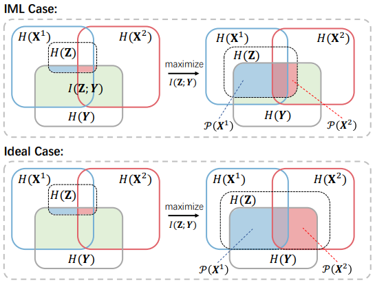

# IBML
 Deep Information-Balanced Multimodal Learning (TPAMI 2026 Pytorch Code)



## Abstract
Multimodal learning aims to integrate diverse data sources to capture more comprehensive information about things, thus enhancing perception and understanding of the real world. However, inherent discrepancies between different modalities often lead to imbalanced optimization during multimodal learning, hindering performance improvement. To address this issue, in this paper, we present a Multimodal Information Balance (MIB) theory, grounded in Information Theory, to reveal that this imbalance arises from the imbalanced retention of complementary information during modality fusion, providing an intuitive and explainable perspective on the issue. Building on this insight, we propose a theoretical MIB criterion to adaptively balance the preservation of complementary information across individual modalities, thereby facilitating multimodal fusion. Using this criterion, we develop an Information-Balanced Multimodal Learning (IBML) framework to mine comprehensive and balanced multimodal information, achieving optimal learning. More specifically, IBML introduces Balance Information Optimization (BIO) module to maximize tractable lower bound objectives derived from the MIB criterion according to the optimization discrepancies across modalities, ensuring balanced retention of complementary information and enhancing information contributions during multimodal fusion. In addition, we present a supplementary and provable Task Complexity Modulation (TCM) module based on the MIB criterion to adjust task complexity discrepancies across input modalities, thus indirectly promoting the balanced preservation of complementary information throughout the learning process. Extensive experiments are conducted on eight multimodal datasets, spanning audio-visual recognition, image-text classification, and 2D-3D recognition, to verify the superiority and effectiveness of IBML. 

## 📕 Data

### Audio-Vision Recognition
- CREMAD and AVE:

See data_process.zip

Read or run `bash run.sh`

- avsbench and VGGSound50

```
IBML_data ([here](https://modelscope.cn/datasets/yangsss/IBML_data))
│
├── avsbench
│     └── avsbench.tar.gz
│
└── VGGSound50
      ├── Image-01-FPS.tar.gz
      ├── audios.tar.gz
      ├── train.txt
      └── test.txt

### Image-Text Classification
- food101 and MVSA

See data_process.zip

Read or run `bash run.sh`

### 2D-3D Classification
- 3D MNIST

We have provided the preprocessed data for you on [Dropbox](https://www.dropbox.com/scl/fo/zqgf44jsdqflge81nk1ml/ABSD8fj9F0_anJWmk_M2Mio?rlkey=zqohocqvfj9ho2oqvclvkq9kk&e=1&dl=0). Please place it under `data\3D_MNIST`.

If you use raw data [Kaggle-3D MNIST](https://www.kaggle.com/datasets/daavoo/3d-mnist), suitable data augmentation can bring the performance of the method to a higher level.

- ModelNet 40  

We have also provided the preprocessed 3D data for you on [Dropbox](https://www.dropbox.com/scl/fo/2oyahbyp4scnkvb5k96sk/h?rlkey=ujg89pc3sturtbtyozhipgiew&e=1&dl=0). Please place it under `data\ModelNet40`. In addition, the 180-view 2D images are large. Please refer to this link (https://github.com/LongLong-Jing/Cross-Modal-Center-Loss/issues/2) to download them, and then place them under `data\ModelNet40`.

All data processing procedures refer to:  
https://github.com/penghu-cs/RONO  
and  
https://github.com/LongLong-Jing/Cross-Modal-Center-Loss  

If you encounter any issues, please consult the guidance or issues sections of these projects.

## 📦 Requirements

- python>=3.8
- torch
- torchvision
- numpy
- torchtext
- tensorboard
- tqdm

## 🔨 Training and Testing 
After placing the data in the `./data` directory, you can begin training and testing. Specifically, the paper has the following three tasks:
### Audio-Vision Recognition
Modify the appropriate configuration, then run:

`bash ./train_AV_IBML.sh`

### Image-Text Classification
Modify the appropriate configuration, then run:

`bash ./train_VL_IBML.sh`

### 2D-3D Classification
Modify the appropriate configuration, then run:

`bash ./train_2D3D_IBML.sh`

## Reference 🤗
If this paper is helpful for your research, please cite:
```bibtex
@article{qin2026deep,
  title={Deep Information-Balanced Multimodal Learning},
  author={Qin, Yang and Feng, Yanglin and Sun, Yuan and Peng, Dezhong and Peng, Xi and Hu, Peng},
  journal={IEEE Transactions on Pattern Analysis and Machine Intelligence},
  year={2026},
  publisher={IEEE}
}
```
